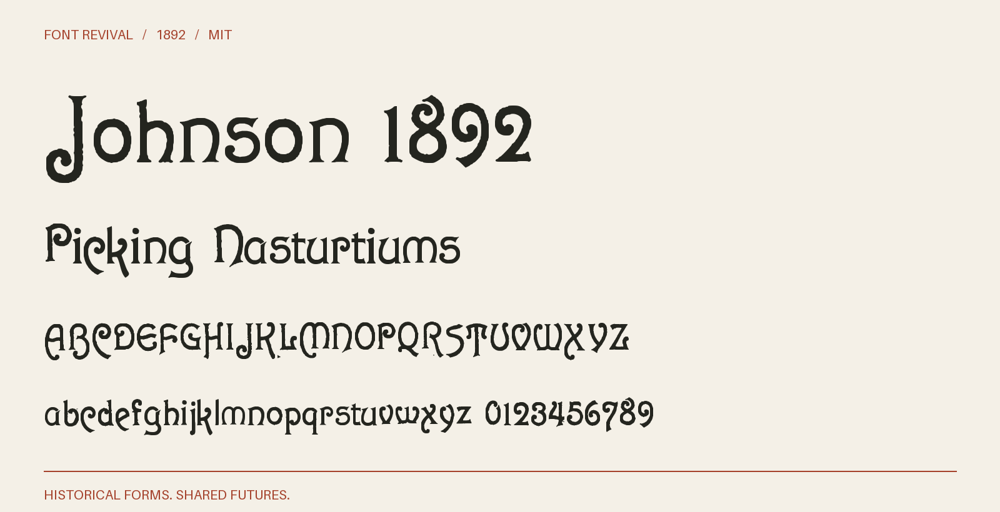
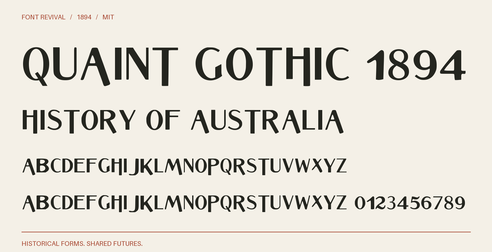
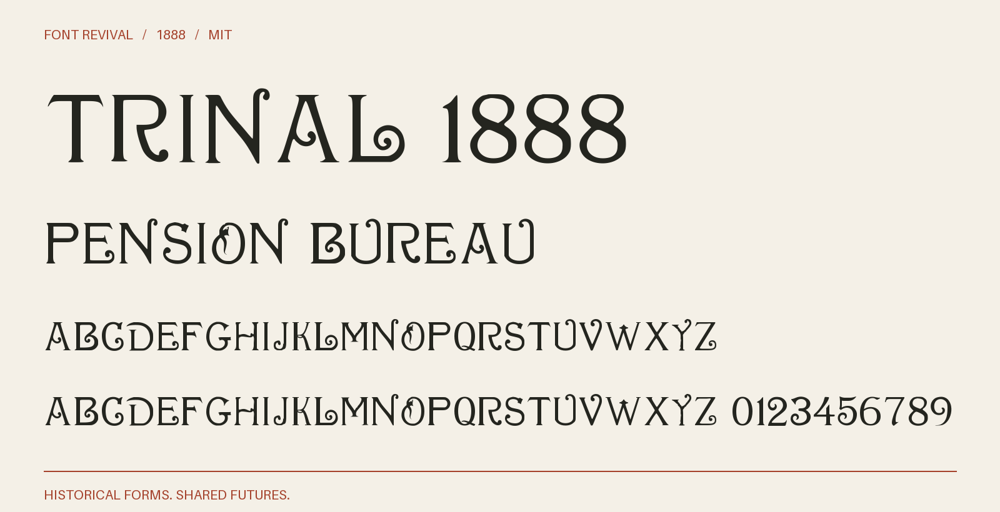

# Font Revival

**Historical forms. Shared futures.**

An open collection of historical typefaces, revived as usable digital fonts.
Download them, make something with them, and help make them better.

[Browse & try the fonts](https://haroldus-.github.io/font-revival/) ·
[Download releases](https://github.com/haroldus-/font-revival/releases) ·
[Contribute](CONTRIBUTING.md) · [MIT License](LICENSE)

## The collection

### Johnson 1892

Herman Ihlenburg's exuberant ornamental face for MacKellar, Smiths & Jordan.
Knob-ended curls, rounded strokes, and a deliberately irregular rhythm.

[](collection/johnson-1892)

[OTF](collection/johnson-1892/fonts/Johnson1892-Regular.otf) ·
[TTF](collection/johnson-1892/fonts/Johnson1892-Regular.ttf) ·
[Webfont](collection/johnson-1892/web/) ·
[Specimen PDF](collection/johnson-1892/specimens/specimen.pdf) ·
[Sources & details](collection/johnson-1892)

### Nero 1888

A narrow, chiseled display face attributed to Julius Herriet, Sr., issued by
James Conner's Sons. Pointed terminals, deep notches, and dramatic descenders.

[](collection/nero-1888)

[OTF](collection/nero-1888/fonts/Nero1888-Regular.otf) ·
[TTF](collection/nero-1888/fonts/Nero1888-Regular.ttf) ·
[Webfont](collection/nero-1888/web/) ·
[Specimen PDF](collection/nero-1888/specimens/specimen.pdf) ·
[Sources & details](collection/nero-1888)

### Quaint Gothic 1894

Contrasting sans-serif capitals from the John Ryan specimen: narrow hairlines,
long descending strokes, and a striking display rhythm. Lowercase input uses capitals.

[](collection/quaint-gothic-1894)

[OTF](collection/quaint-gothic-1894/fonts/QuaintGothic1894-Regular.otf) ·
[TTF](collection/quaint-gothic-1894/fonts/QuaintGothic1894-Regular.ttf) ·
[Webfont](collection/quaint-gothic-1894/web/) ·
[Specimen PDF](collection/quaint-gothic-1894/specimens/specimen.pdf) ·
[Source comparison](collection/quaint-gothic-1894/specimens/source-review.pdf) ·
[Sources & details](collection/quaint-gothic-1894)

### Trinal 1888

William F. Capitain's curled capitals for Marder, Luse & Co., with fine serifs,
open bowls, and looping terminals. Lowercase input uses capitals.

[](collection/trinal-1888)

[OTF](collection/trinal-1888/fonts/Trinal1888-Regular.otf) ·
[TTF](collection/trinal-1888/fonts/Trinal1888-Regular.ttf) ·
[Webfont](collection/trinal-1888/web/) ·
[Specimen PDF](collection/trinal-1888/specimens/specimen.pdf) ·
[Source comparison](collection/trinal-1888/specimens/source-review.pdf) ·
[Sources & details](collection/trinal-1888)

The [1894 Ryan / November 1888 survey](docs/PROSPECTS-1894-1888.md) records why
these two were selected and the strongest candidates for later work.

## Use the fonts

Download a release ZIP, or open a font link above and choose **Download raw file**.
Install either the OTF or TTF for desktop use. For a website, copy a family's
`web/` folder and include its `font.css`:

```html
<link rel="stylesheet" href="/fonts/nero-1888/font.css">
<h1 style="font-family: 'Nero 1888', serif">Old forms. New life.</h1>
```

Personal and commercial use, modification, embedding, and redistribution are
permitted under the MIT license. Keep the license with redistributed font files.

## Build the collection

Use Python 3.12. After installing the pinned dependencies, builds run offline.

```sh
git clone https://github.com/haroldus-/font-revival.git
cd font-revival
python3 -m venv .venv
source .venv/bin/activate
python -m pip install -r requirements.txt
python scripts/fontrevival.py build
python scripts/fontrevival.py check
```

On Windows, activate with `.venv\Scripts\Activate.ps1` in PowerShell.
Preview the collection with `python -m http.server 8000`, then open
<http://localhost:8000>. Make downloadable ZIPs with
`python scripts/fontrevival.py package`.

## Add a revival. Improve a letter.

Give your LLM historical scans or PDFs in `workspace/` and ask it to follow
[AGENTS.md](AGENTS.md) and the [shared workflow](docs/WORKFLOW.md).
The same process works locally, in a fork, and in a pull request.

Each family has one editable OpenType XML master, optional individual glyph
edits, a source record, and a changelog. The shared build produces OTF, TTF,
WOFF, WOFF2, PDF and PNG specimens, checksums, and the browser gallery.
The check command rebuilds in isolation and verifies the committed outputs.

Start with [CONTRIBUTING.md](CONTRIBUTING.md). Small improvements are welcome:
a better `j`, more faithful spacing, a newly discovered specimen, or a missing accent.

## Open by design

Use historical material with a documented public-domain basis. Trace historical
sources directly and record which forms are observed and which are reconstructed.
Each family's `font.json` records its sources and rights basis; historical
reference material retains that status. Project code, documentation, and digital
font contributions are [MIT licensed](LICENSE). See [source policy](docs/SOURCES.md).

The initial revivals were prepared with GPT-5.6 Sol. All contributions are
reviewed through their sources, font files, and visual proofs.
