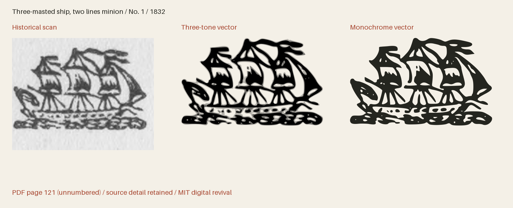

# Baltimore Cuts 1832

Historical cuts from A specimen of printing types and ornaments from the Baltimore Type Foundry (1832).



**381 icon(s) · Version 1.001 · MIT**

[SVG files](svg/) · [SVG sprite](web/icons.svg) · [OTF](fonts/BaltimoreCuts1832-Regular.otf) · [TTF](fonts/BaltimoreCuts1832-Regular.ttf) · [WOFF2](web/BaltimoreCuts1832-Regular.woff2) · [Comparison and size proof](specimens/specimen.pdf) · [Icon manifest](icons.json) · [Changes](CHANGELOG.md)

[Three-tone SVGs](svg/multitone/) · [Three-tone sprite](web/icons-multitone.svg) · [Transparent three-tone PNGs](png/multitone/)

## Use in HTML

[Download all web bundle parts](#web-bundle-parts), unzip it, and place
the extracted `collection` folder beside your HTML file. Keep its subfolders
together. The examples below then work as written; adjust the paths if you move
the folder elsewhere. The bundle contains SVGs, PNGs, fonts, CSS, instructions
and the license. No JavaScript or font installation is needed for SVG use.

### Three-tone image — works from disk too

The individual SVG displays all three tones at their default strengths, with a
transparent background. Change `height` to resize it; the proportions are retained.

```html

```

An `` has its own colour context: page CSS cannot recolour its internal
regions. For a decorative image beside a text label, use `alt=""` instead.

### Three-tone sprite — customise every tone

Copy `web/icons-multitone.svg` and use the following complete example on an
HTTP(S) page served from the same origin as the sprite. It draws dark primary ink
and two strengths of red. Each colour and opacity can be changed independently.

```html
<style>
  .revival-cut {
    display: inline-block;
    font-size: 96px;
    height: 1em;
    width: 0.941406em;
    vertical-align: middle;
    --fr-primary-color: #24251f;
    --fr-secondary-color: #a5422c;
    --fr-tertiary-color: #a5422c;
    --fr-primary-opacity: 1;
    --fr-secondary-opacity: 0.55;
    --fr-tertiary-opacity: 0.25;
  }
</style>
<svg class="revival-cut" role="img" aria-label="Three-masted ship, two lines minion">
  <use href="collection/baltimore-cuts-1832/web/icons-multitone.svg#baltimore-1832-p121-1"></use>
</svg>
```

Use the same secondary and tertiary colour and opacity for a two-tone appearance.
The defaults are primary 100%, secondary 55% and tertiary 25%; these are separate
vector regions, not a gradient. The tone assignments interpret the historical
impression. A transparent PNG of the default tones is also provided.

External SVG sprites can be blocked on `file://` pages. To customise tones on a
page opened from disk, open the individual SVG in a text editor, copy its complete
`<svg>…</svg>` markup into your HTML, and add `class="revival-cut"` to that SVG.
The same CSS above then applies to its inline paths. Keep its `viewBox` and paths.
The gallery itself uses inline SVG so its previews work directly from disk.

### Monochrome icon font

Copy the whole `web/` folder, including CSS and webfonts. Standard icon fonts show
the solid artwork; use the SVG examples above for three-tone artwork.

```html
<link rel="stylesheet" href="collection/baltimore-cuts-1832/web/icons.css">
<span class="fr-icon fr-baltimore-1832-p121-1" aria-hidden="true"
      style="font-size:96px;color:#a5422c"></span>
<span>Three-masted ship, two lines minion</span>
```

The example hides a decorative icon from screen readers and supplies visible
text. For an icon that conveys meaning on its own, use `role="img"` and an
`aria-label` instead of `aria-hidden`. Font size and colour use ordinary CSS.

Install the OTF or TTF for desktop use. The manifest lists Private Use codepoints
(pilot: U+E000); these are not ordinary text characters. IDs and
codepoints are permanent within this collection. Keep the included LICENSE with
redistributed assets. Detailed cuts need display sizes: the pilot is recommended
from 64 px, with 16–192 pt proofs supplied for review.

## Evidence and editing

**Foundry:** Baltimore Type Foundry; F. Lucas, Jr., agent

**Designer:** Baltimore Type Foundry; individual engravers generally unidentified (signed large cuts credited in the source inventory)

**Observed:** Observed impressions from the supplied 1832 Baltimore specimen. Every crop is mapped to a one-based PDF page of this unpaginated book; original JP2 leaves and exact preparation records are retained.

**Interpreted or new:** No new pictorial content. Thresholding, documented crop cleanup, cubic curve fitting and font-unit rounding interpret the scanned impressions. Names, search tags, Private Use assignments, scale and bearings are new project work. Paper, catalogue numbers and prices are excluded. Multi-tone companions separate observed ink strengths into three disjoint vector regions at default opacities 1, 0.55 and 0.25; these are modern interpretations, not evidence of separately printed inks. Format-specific downloadable-font approximations include modern fine diagonal coverage screening for seven especially dense cuts; original engraved linework remains in the master and SVG. In version 1.001, 167 complete cuts and their tone layers receive documented rigid rotations to level observed frames or bases; no historical contour is redrawn or removed.

- [A specimen of printing types and ornaments from the Baltimore Type Foundry (1832), unnumbered leaf; PDF page 121, Internet Archive leaf 120](https://archive.org/details/ldpd_12198261_000/page/n120/mode/1up) — 1832 US publication, public domain by age; Columbia University Libraries historical scan, distributed through Internet Archive. DPLA item c773fb687c8cc1c610a04becf6baf8e2 records Public domain. No modern digital font or redrawing was used. The MIT license applies to original project work, not ownership of the historical design. [Rights basis](https://dp.la/item/c773fb687c8cc1c610a04becf6baf8e2).
- [A specimen of printing types and ornaments from the Baltimore Type Foundry (1832), unnumbered leaf; PDF page 123, Internet Archive leaf 122](https://archive.org/details/ldpd_12198261_000/page/n122/mode/1up) — 1832 US publication, public domain by age; Columbia University Libraries historical scan, distributed through Internet Archive. DPLA item c773fb687c8cc1c610a04becf6baf8e2 records Public domain. No modern digital font or redrawing was used. The MIT license applies to original project work, not ownership of the historical design. [Rights basis](https://dp.la/item/c773fb687c8cc1c610a04becf6baf8e2).
- [A specimen of printing types and ornaments from the Baltimore Type Foundry (1832), unnumbered leaf; PDF page 125, Internet Archive leaf 124](https://archive.org/details/ldpd_12198261_000/page/n124/mode/1up) — 1832 US publication, public domain by age; Columbia University Libraries historical scan, distributed through Internet Archive. DPLA item c773fb687c8cc1c610a04becf6baf8e2 records Public domain. No modern digital font or redrawing was used. The MIT license applies to original project work, not ownership of the historical design. [Rights basis](https://dp.la/item/c773fb687c8cc1c610a04becf6baf8e2).
- [A specimen of printing types and ornaments from the Baltimore Type Foundry (1832), unnumbered leaf; PDF page 127, Internet Archive leaf 126](https://archive.org/details/ldpd_12198261_000/page/n126/mode/1up) — 1832 US publication, public domain by age; Columbia University Libraries historical scan, distributed through Internet Archive. DPLA item c773fb687c8cc1c610a04becf6baf8e2 records Public domain. No modern digital font or redrawing was used. The MIT license applies to original project work, not ownership of the historical design. [Rights basis](https://dp.la/item/c773fb687c8cc1c610a04becf6baf8e2).
- [A specimen of printing types and ornaments from the Baltimore Type Foundry (1832), unnumbered leaf; PDF page 129, Internet Archive leaf 128](https://archive.org/details/ldpd_12198261_000/page/n128/mode/1up) — 1832 US publication, public domain by age; Columbia University Libraries historical scan, distributed through Internet Archive. DPLA item c773fb687c8cc1c610a04becf6baf8e2 records Public domain. No modern digital font or redrawing was used. The MIT license applies to original project work, not ownership of the historical design. [Rights basis](https://dp.la/item/c773fb687c8cc1c610a04becf6baf8e2).
- [A specimen of printing types and ornaments from the Baltimore Type Foundry (1832), unnumbered leaf; PDF page 131, Internet Archive leaf 130](https://archive.org/details/ldpd_12198261_000/page/n130/mode/1up) — 1832 US publication, public domain by age; Columbia University Libraries historical scan, distributed through Internet Archive. DPLA item c773fb687c8cc1c610a04becf6baf8e2 records Public domain. No modern digital font or redrawing was used. The MIT license applies to original project work, not ownership of the historical design. [Rights basis](https://dp.la/item/c773fb687c8cc1c610a04becf6baf8e2).
- [A specimen of printing types and ornaments from the Baltimore Type Foundry (1832), unnumbered leaf; PDF page 133, Internet Archive leaf 132](https://archive.org/details/ldpd_12198261_000/page/n132/mode/1up) — 1832 US publication, public domain by age; Columbia University Libraries historical scan, distributed through Internet Archive. DPLA item c773fb687c8cc1c610a04becf6baf8e2 records Public domain. No modern digital font or redrawing was used. The MIT license applies to original project work, not ownership of the historical design. [Rights basis](https://dp.la/item/c773fb687c8cc1c610a04becf6baf8e2).
- [A specimen of printing types and ornaments from the Baltimore Type Foundry (1832), unnumbered leaf; PDF page 135, Internet Archive leaf 134](https://archive.org/details/ldpd_12198261_000/page/n134/mode/1up) — 1832 US publication, public domain by age; Columbia University Libraries historical scan, distributed through Internet Archive. DPLA item c773fb687c8cc1c610a04becf6baf8e2 records Public domain. No modern digital font or redrawing was used. The MIT license applies to original project work, not ownership of the historical design. [Rights basis](https://dp.la/item/c773fb687c8cc1c610a04becf6baf8e2).
- [A specimen of printing types and ornaments from the Baltimore Type Foundry (1832), unnumbered leaf; PDF page 137, Internet Archive leaf 136](https://archive.org/details/ldpd_12198261_000/page/n136/mode/1up) — 1832 US publication, public domain by age; Columbia University Libraries historical scan, distributed through Internet Archive. DPLA item c773fb687c8cc1c610a04becf6baf8e2 records Public domain. No modern digital font or redrawing was used. The MIT license applies to original project work, not ownership of the historical design. [Rights basis](https://dp.la/item/c773fb687c8cc1c610a04becf6baf8e2).
- [A specimen of printing types and ornaments from the Baltimore Type Foundry (1832), unnumbered leaf; PDF page 139, Internet Archive leaf 138](https://archive.org/details/ldpd_12198261_000/page/n138/mode/1up) — 1832 US publication, public domain by age; Columbia University Libraries historical scan, distributed through Internet Archive. DPLA item c773fb687c8cc1c610a04becf6baf8e2 records Public domain. No modern digital font or redrawing was used. The MIT license applies to original project work, not ownership of the historical design. [Rights basis](https://dp.la/item/c773fb687c8cc1c610a04becf6baf8e2).
- [A specimen of printing types and ornaments from the Baltimore Type Foundry (1832), unnumbered leaf; PDF page 141, Internet Archive leaf 140](https://archive.org/details/ldpd_12198261_000/page/n140/mode/1up) — 1832 US publication, public domain by age; Columbia University Libraries historical scan, distributed through Internet Archive. DPLA item c773fb687c8cc1c610a04becf6baf8e2 records Public domain. No modern digital font or redrawing was used. The MIT license applies to original project work, not ownership of the historical design. [Rights basis](https://dp.la/item/c773fb687c8cc1c610a04becf6baf8e2).
- [A specimen of printing types and ornaments from the Baltimore Type Foundry (1832), unnumbered leaf; PDF page 143, Internet Archive leaf 142](https://archive.org/details/ldpd_12198261_000/page/n142/mode/1up) — 1832 US publication, public domain by age; Columbia University Libraries historical scan, distributed through Internet Archive. DPLA item c773fb687c8cc1c610a04becf6baf8e2 records Public domain. No modern digital font or redrawing was used. The MIT license applies to original project work, not ownership of the historical design. [Rights basis](https://dp.la/item/c773fb687c8cc1c610a04becf6baf8e2).
- [A specimen of printing types and ornaments from the Baltimore Type Foundry (1832), unnumbered leaf; PDF page 145, Internet Archive leaf 144](https://archive.org/details/ldpd_12198261_000/page/n144/mode/1up) — 1832 US publication, public domain by age; Columbia University Libraries historical scan, distributed through Internet Archive. DPLA item c773fb687c8cc1c610a04becf6baf8e2 records Public domain. No modern digital font or redrawing was used. The MIT license applies to original project work, not ownership of the historical design. [Rights basis](https://dp.la/item/c773fb687c8cc1c610a04becf6baf8e2).
- [A specimen of printing types and ornaments from the Baltimore Type Foundry (1832), unnumbered leaf; PDF page 147, Internet Archive leaf 146](https://archive.org/details/ldpd_12198261_000/page/n146/mode/1up) — 1832 US publication, public domain by age; Columbia University Libraries historical scan, distributed through Internet Archive. DPLA item c773fb687c8cc1c610a04becf6baf8e2 records Public domain. No modern digital font or redrawing was used. The MIT license applies to original project work, not ownership of the historical design. [Rights basis](https://dp.la/item/c773fb687c8cc1c610a04becf6baf8e2).
- [A specimen of printing types and ornaments from the Baltimore Type Foundry (1832), unnumbered leaf; PDF page 149, Internet Archive leaf 148](https://archive.org/details/ldpd_12198261_000/page/n148/mode/1up) — 1832 US publication, public domain by age; Columbia University Libraries historical scan, distributed through Internet Archive. DPLA item c773fb687c8cc1c610a04becf6baf8e2 records Public domain. No modern digital font or redrawing was used. The MIT license applies to original project work, not ownership of the historical design. [Rights basis](https://dp.la/item/c773fb687c8cc1c610a04becf6baf8e2).
- [A specimen of printing types and ornaments from the Baltimore Type Foundry (1832), unnumbered leaf; PDF page 151, Internet Archive leaf 150](https://archive.org/details/ldpd_12198261_000/page/n150/mode/1up) — 1832 US publication, public domain by age; Columbia University Libraries historical scan, distributed through Internet Archive. DPLA item c773fb687c8cc1c610a04becf6baf8e2 records Public domain. No modern digital font or redrawing was used. The MIT license applies to original project work, not ownership of the historical design. [Rights basis](https://dp.la/item/c773fb687c8cc1c610a04becf6baf8e2).
- [A specimen of printing types and ornaments from the Baltimore Type Foundry (1832), unnumbered leaf; PDF page 153, Internet Archive leaf 152](https://archive.org/details/ldpd_12198261_000/page/n152/mode/1up) — 1832 US publication, public domain by age; Columbia University Libraries historical scan, distributed through Internet Archive. DPLA item c773fb687c8cc1c610a04becf6baf8e2 records Public domain. No modern digital font or redrawing was used. The MIT license applies to original project work, not ownership of the historical design. [Rights basis](https://dp.la/item/c773fb687c8cc1c610a04becf6baf8e2).
- [A specimen of printing types and ornaments from the Baltimore Type Foundry (1832), unnumbered leaf; PDF page 155, Internet Archive leaf 154](https://archive.org/details/ldpd_12198261_000/page/n154/mode/1up) — 1832 US publication, public domain by age; Columbia University Libraries historical scan, distributed through Internet Archive. DPLA item c773fb687c8cc1c610a04becf6baf8e2 records Public domain. No modern digital font or redrawing was used. The MIT license applies to original project work, not ownership of the historical design. [Rights basis](https://dp.la/item/c773fb687c8cc1c610a04becf6baf8e2).
- [A specimen of printing types and ornaments from the Baltimore Type Foundry (1832), unnumbered leaf; PDF page 157, Internet Archive leaf 156](https://archive.org/details/ldpd_12198261_000/page/n156/mode/1up) — 1832 US publication, public domain by age; Columbia University Libraries historical scan, distributed through Internet Archive. DPLA item c773fb687c8cc1c610a04becf6baf8e2 records Public domain. No modern digital font or redrawing was used. The MIT license applies to original project work, not ownership of the historical design. [Rights basis](https://dp.la/item/c773fb687c8cc1c610a04becf6baf8e2).
- [A specimen of printing types and ornaments from the Baltimore Type Foundry (1832), unnumbered leaf; PDF page 159, Internet Archive leaf 158](https://archive.org/details/ldpd_12198261_000/page/n158/mode/1up) — 1832 US publication, public domain by age; Columbia University Libraries historical scan, distributed through Internet Archive. DPLA item c773fb687c8cc1c610a04becf6baf8e2 records Public domain. No modern digital font or redrawing was used. The MIT license applies to original project work, not ownership of the historical design. [Rights basis](https://dp.la/item/c773fb687c8cc1c610a04becf6baf8e2).
- [A specimen of printing types and ornaments from the Baltimore Type Foundry (1832), unnumbered leaf; PDF page 161, Internet Archive leaf 160](https://archive.org/details/ldpd_12198261_000/page/n160/mode/1up) — 1832 US publication, public domain by age; Columbia University Libraries historical scan, distributed through Internet Archive. DPLA item c773fb687c8cc1c610a04becf6baf8e2 records Public domain. No modern digital font or redrawing was used. The MIT license applies to original project work, not ownership of the historical design. [Rights basis](https://dp.la/item/c773fb687c8cc1c610a04becf6baf8e2).
- [A specimen of printing types and ornaments from the Baltimore Type Foundry (1832), unnumbered leaf; PDF page 163, Internet Archive leaf 162](https://archive.org/details/ldpd_12198261_000/page/n162/mode/1up) — 1832 US publication, public domain by age; Columbia University Libraries historical scan, distributed through Internet Archive. DPLA item c773fb687c8cc1c610a04becf6baf8e2 records Public domain. No modern digital font or redrawing was used. The MIT license applies to original project work, not ownership of the historical design. [Rights basis](https://dp.la/item/c773fb687c8cc1c610a04becf6baf8e2).
- [A specimen of printing types and ornaments from the Baltimore Type Foundry (1832), unnumbered leaf; PDF page 165, Internet Archive leaf 164](https://archive.org/details/ldpd_12198261_000/page/n164/mode/1up) — 1832 US publication, public domain by age; Columbia University Libraries historical scan, distributed through Internet Archive. DPLA item c773fb687c8cc1c610a04becf6baf8e2 records Public domain. No modern digital font or redrawing was used. The MIT license applies to original project work, not ownership of the historical design. [Rights basis](https://dp.la/item/c773fb687c8cc1c610a04becf6baf8e2).
- [A specimen of printing types and ornaments from the Baltimore Type Foundry (1832), unnumbered leaf; PDF page 171, Internet Archive leaf 170](https://archive.org/details/ldpd_12198261_000/page/n170/mode/1up) — 1832 US publication, public domain by age; Columbia University Libraries historical scan, distributed through Internet Archive. DPLA item c773fb687c8cc1c610a04becf6baf8e2 records Public domain. No modern digital font or redrawing was used. The MIT license applies to original project work, not ownership of the historical design. [Rights basis](https://dp.la/item/c773fb687c8cc1c610a04becf6baf8e2).
- [A specimen of printing types and ornaments from the Baltimore Type Foundry (1832), unnumbered leaf; PDF page 173, Internet Archive leaf 172](https://archive.org/details/ldpd_12198261_000/page/n172/mode/1up) — 1832 US publication, public domain by age; Columbia University Libraries historical scan, distributed through Internet Archive. DPLA item c773fb687c8cc1c610a04becf6baf8e2 records Public domain. No modern digital font or redrawing was used. The MIT license applies to original project work, not ownership of the historical design. [Rights basis](https://dp.la/item/c773fb687c8cc1c610a04becf6baf8e2).
- [A specimen of printing types and ornaments from the Baltimore Type Foundry (1832), unnumbered leaf; PDF page 175, Internet Archive leaf 174](https://archive.org/details/ldpd_12198261_000/page/n174/mode/1up) — 1832 US publication, public domain by age; Columbia University Libraries historical scan, distributed through Internet Archive. DPLA item c773fb687c8cc1c610a04becf6baf8e2 records Public domain. No modern digital font or redrawing was used. The MIT license applies to original project work, not ownership of the historical design. [Rights basis](https://dp.la/item/c773fb687c8cc1c610a04becf6baf8e2).
- [A specimen of printing types and ornaments from the Baltimore Type Foundry (1832), unnumbered leaf; PDF page 177, Internet Archive leaf 176](https://archive.org/details/ldpd_12198261_000/page/n176/mode/1up) — 1832 US publication, public domain by age; Columbia University Libraries historical scan, distributed through Internet Archive. DPLA item c773fb687c8cc1c610a04becf6baf8e2 records Public domain. No modern digital font or redrawing was used. The MIT license applies to original project work, not ownership of the historical design. [Rights basis](https://dp.la/item/c773fb687c8cc1c610a04becf6baf8e2).
- [A specimen of printing types and ornaments from the Baltimore Type Foundry (1832), unnumbered leaf; PDF page 179, Internet Archive leaf 178](https://archive.org/details/ldpd_12198261_000/page/n178/mode/1up) — 1832 US publication, public domain by age; Columbia University Libraries historical scan, distributed through Internet Archive. DPLA item c773fb687c8cc1c610a04becf6baf8e2 records Public domain. No modern digital font or redrawing was used. The MIT license applies to original project work, not ownership of the historical design. [Rights basis](https://dp.la/item/c773fb687c8cc1c610a04becf6baf8e2).
- [A specimen of printing types and ornaments from the Baltimore Type Foundry (1832), unnumbered leaf; PDF page 181, Internet Archive leaf 180](https://archive.org/details/ldpd_12198261_000/page/n180/mode/1up) — 1832 US publication, public domain by age; Columbia University Libraries historical scan, distributed through Internet Archive. DPLA item c773fb687c8cc1c610a04becf6baf8e2 records Public domain. No modern digital font or redrawing was used. The MIT license applies to original project work, not ownership of the historical design. [Rights basis](https://dp.la/item/c773fb687c8cc1c610a04becf6baf8e2).
- [A specimen of printing types and ornaments from the Baltimore Type Foundry (1832), unnumbered leaf; PDF page 183, Internet Archive leaf 182](https://archive.org/details/ldpd_12198261_000/page/n182/mode/1up) — 1832 US publication, public domain by age; Columbia University Libraries historical scan, distributed through Internet Archive. DPLA item c773fb687c8cc1c610a04becf6baf8e2 records Public domain. No modern digital font or redrawing was used. The MIT license applies to original project work, not ownership of the historical design. [Rights basis](https://dp.la/item/c773fb687c8cc1c610a04becf6baf8e2).
- [A specimen of printing types and ornaments from the Baltimore Type Foundry (1832), unnumbered leaf; PDF page 185, Internet Archive leaf 184](https://archive.org/details/ldpd_12198261_000/page/n184/mode/1up) — 1832 US publication, public domain by age; Columbia University Libraries historical scan, distributed through Internet Archive. DPLA item c773fb687c8cc1c610a04becf6baf8e2 records Public domain. No modern digital font or redrawing was used. The MIT license applies to original project work, not ownership of the historical design. [Rights basis](https://dp.la/item/c773fb687c8cc1c610a04becf6baf8e2).
- [A specimen of printing types and ornaments from the Baltimore Type Foundry (1832), unnumbered leaf; PDF page 187, Internet Archive leaf 186](https://archive.org/details/ldpd_12198261_000/page/n186/mode/1up) — 1832 US publication, public domain by age; Columbia University Libraries historical scan, distributed through Internet Archive. DPLA item c773fb687c8cc1c610a04becf6baf8e2 records Public domain. No modern digital font or redrawing was used. The MIT license applies to original project work, not ownership of the historical design. [Rights basis](https://dp.la/item/c773fb687c8cc1c610a04becf6baf8e2).
- [A specimen of printing types and ornaments from the Baltimore Type Foundry (1832), unnumbered leaf; PDF page 189, Internet Archive leaf 188](https://archive.org/details/ldpd_12198261_000/page/n188/mode/1up) — 1832 US publication, public domain by age; Columbia University Libraries historical scan, distributed through Internet Archive. DPLA item c773fb687c8cc1c610a04becf6baf8e2 records Public domain. No modern digital font or redrawing was used. The MIT license applies to original project work, not ownership of the historical design. [Rights basis](https://dp.la/item/c773fb687c8cc1c610a04becf6baf8e2).
- [A specimen of printing types and ornaments from the Baltimore Type Foundry (1832), unnumbered leaf; PDF page 191, Internet Archive leaf 190](https://archive.org/details/ldpd_12198261_000/page/n190/mode/1up) — 1832 US publication, public domain by age; Columbia University Libraries historical scan, distributed through Internet Archive. DPLA item c773fb687c8cc1c610a04becf6baf8e2 records Public domain. No modern digital font or redrawing was used. The MIT license applies to original project work, not ownership of the historical design. [Rights basis](https://dp.la/item/c773fb687c8cc1c610a04becf6baf8e2).
- [A specimen of printing types and ornaments from the Baltimore Type Foundry (1832), unnumbered leaf; PDF page 193, Internet Archive leaf 192](https://archive.org/details/ldpd_12198261_000/page/n192/mode/1up) — 1832 US publication, public domain by age; Columbia University Libraries historical scan, distributed through Internet Archive. DPLA item c773fb687c8cc1c610a04becf6baf8e2 records Public domain. No modern digital font or redrawing was used. The MIT license applies to original project work, not ownership of the historical design. [Rights basis](https://dp.la/item/c773fb687c8cc1c610a04becf6baf8e2).
- [A specimen of printing types and ornaments from the Baltimore Type Foundry (1832), unnumbered leaf; PDF page 195, Internet Archive leaf 194](https://archive.org/details/ldpd_12198261_000/page/n194/mode/1up) — 1832 US publication, public domain by age; Columbia University Libraries historical scan, distributed through Internet Archive. DPLA item c773fb687c8cc1c610a04becf6baf8e2 records Public domain. No modern digital font or redrawing was used. The MIT license applies to original project work, not ownership of the historical design. [Rights basis](https://dp.la/item/c773fb687c8cc1c610a04becf6baf8e2).
- [A specimen of printing types and ornaments from the Baltimore Type Foundry (1832), unnumbered leaf; PDF page 197, Internet Archive leaf 196](https://archive.org/details/ldpd_12198261_000/page/n196/mode/1up) — 1832 US publication, public domain by age; Columbia University Libraries historical scan, distributed through Internet Archive. DPLA item c773fb687c8cc1c610a04becf6baf8e2 records Public domain. No modern digital font or redrawing was used. The MIT license applies to original project work, not ownership of the historical design. [Rights basis](https://dp.la/item/c773fb687c8cc1c610a04becf6baf8e2).
- [A specimen of printing types and ornaments from the Baltimore Type Foundry (1832), unnumbered leaf; PDF page 199, Internet Archive leaf 198](https://archive.org/details/ldpd_12198261_000/page/n198/mode/1up) — 1832 US publication, public domain by age; Columbia University Libraries historical scan, distributed through Internet Archive. DPLA item c773fb687c8cc1c610a04becf6baf8e2 records Public domain. No modern digital font or redrawing was used. The MIT license applies to original project work, not ownership of the historical design. [Rights basis](https://dp.la/item/c773fb687c8cc1c610a04becf6baf8e2).
- [A specimen of printing types and ornaments from the Baltimore Type Foundry (1832), unnumbered leaf; PDF page 201, Internet Archive leaf 200](https://archive.org/details/ldpd_12198261_000/page/n200/mode/1up) — 1832 US publication, public domain by age; Columbia University Libraries historical scan, distributed through Internet Archive. DPLA item c773fb687c8cc1c610a04becf6baf8e2 records Public domain. No modern digital font or redrawing was used. The MIT license applies to original project work, not ownership of the historical design. [Rights basis](https://dp.la/item/c773fb687c8cc1c610a04becf6baf8e2).
- [A specimen of printing types and ornaments from the Baltimore Type Foundry (1832), unnumbered leaf; PDF page 203, Internet Archive leaf 202](https://archive.org/details/ldpd_12198261_000/page/n202/mode/1up) — 1832 US publication, public domain by age; Columbia University Libraries historical scan, distributed through Internet Archive. DPLA item c773fb687c8cc1c610a04becf6baf8e2 records Public domain. No modern digital font or redrawing was used. The MIT license applies to original project work, not ownership of the historical design. [Rights basis](https://dp.la/item/c773fb687c8cc1c610a04becf6baf8e2).
- [A specimen of printing types and ornaments from the Baltimore Type Foundry (1832), unnumbered leaf; PDF page 205, Internet Archive leaf 204](https://archive.org/details/ldpd_12198261_000/page/n204/mode/1up) — 1832 US publication, public domain by age; Columbia University Libraries historical scan, distributed through Internet Archive. DPLA item c773fb687c8cc1c610a04becf6baf8e2 records Public domain. No modern digital font or redrawing was used. The MIT license applies to original project work, not ownership of the historical design. [Rights basis](https://dp.la/item/c773fb687c8cc1c610a04becf6baf8e2).
- [A specimen of printing types and ornaments from the Baltimore Type Foundry (1832), unnumbered leaf; PDF page 207, Internet Archive leaf 206](https://archive.org/details/ldpd_12198261_000/page/n206/mode/1up) — 1832 US publication, public domain by age; Columbia University Libraries historical scan, distributed through Internet Archive. DPLA item c773fb687c8cc1c610a04becf6baf8e2 records Public domain. No modern digital font or redrawing was used. The MIT license applies to original project work, not ownership of the historical design. [Rights basis](https://dp.la/item/c773fb687c8cc1c610a04becf6baf8e2).
- [A specimen of printing types and ornaments from the Baltimore Type Foundry (1832), unnumbered leaf; PDF page 209, Internet Archive leaf 208](https://archive.org/details/ldpd_12198261_000/page/n208/mode/1up) — 1832 US publication, public domain by age; Columbia University Libraries historical scan, distributed through Internet Archive. DPLA item c773fb687c8cc1c610a04becf6baf8e2 records Public domain. No modern digital font or redrawing was used. The MIT license applies to original project work, not ownership of the historical design. [Rights basis](https://dp.la/item/c773fb687c8cc1c610a04becf6baf8e2).
- [A specimen of printing types and ornaments from the Baltimore Type Foundry (1832), unnumbered leaf; PDF page 211, Internet Archive leaf 210](https://archive.org/details/ldpd_12198261_000/page/n210/mode/1up) — 1832 US publication, public domain by age; Columbia University Libraries historical scan, distributed through Internet Archive. DPLA item c773fb687c8cc1c610a04becf6baf8e2 records Public domain. No modern digital font or redrawing was used. The MIT license applies to original project work, not ownership of the historical design. [Rights basis](https://dp.la/item/c773fb687c8cc1c610a04becf6baf8e2).
- [A specimen of printing types and ornaments from the Baltimore Type Foundry (1832), unnumbered leaf; PDF page 213, Internet Archive leaf 212](https://archive.org/details/ldpd_12198261_000/page/n212/mode/1up) — 1832 US publication, public domain by age; Columbia University Libraries historical scan, distributed through Internet Archive. DPLA item c773fb687c8cc1c610a04becf6baf8e2 records Public domain. No modern digital font or redrawing was used. The MIT license applies to original project work, not ownership of the historical design. [Rights basis](https://dp.la/item/c773fb687c8cc1c610a04becf6baf8e2).
- [A specimen of printing types and ornaments from the Baltimore Type Foundry (1832), unnumbered leaf; PDF page 215, Internet Archive leaf 214](https://archive.org/details/ldpd_12198261_000/page/n214/mode/1up) — 1832 US publication, public domain by age; Columbia University Libraries historical scan, distributed through Internet Archive. DPLA item c773fb687c8cc1c610a04becf6baf8e2 records Public domain. No modern digital font or redrawing was used. The MIT license applies to original project work, not ownership of the historical design. [Rights basis](https://dp.la/item/c773fb687c8cc1c610a04becf6baf8e2).
- [A specimen of printing types and ornaments from the Baltimore Type Foundry (1832), unnumbered leaf; PDF page 217, Internet Archive leaf 216](https://archive.org/details/ldpd_12198261_000/page/n216/mode/1up) — 1832 US publication, public domain by age; Columbia University Libraries historical scan, distributed through Internet Archive. DPLA item c773fb687c8cc1c610a04becf6baf8e2 records Public domain. No modern digital font or redrawing was used. The MIT license applies to original project work, not ownership of the historical design. [Rights basis](https://dp.la/item/c773fb687c8cc1c610a04becf6baf8e2).
- [A specimen of printing types and ornaments from the Baltimore Type Foundry (1832), unnumbered leaf; PDF page 219, Internet Archive leaf 218](https://archive.org/details/ldpd_12198261_000/page/n218/mode/1up) — 1832 US publication, public domain by age; Columbia University Libraries historical scan, distributed through Internet Archive. DPLA item c773fb687c8cc1c610a04becf6baf8e2 records Public domain. No modern digital font or redrawing was used. The MIT license applies to original project work, not ownership of the historical design. [Rights basis](https://dp.la/item/c773fb687c8cc1c610a04becf6baf8e2).
- [A specimen of printing types and ornaments from the Baltimore Type Foundry (1832), unnumbered leaf; PDF page 221, Internet Archive leaf 220](https://archive.org/details/ldpd_12198261_000/page/n220/mode/1up) — 1832 US publication, public domain by age; Columbia University Libraries historical scan, distributed through Internet Archive. DPLA item c773fb687c8cc1c610a04becf6baf8e2 records Public domain. No modern digital font or redrawing was used. The MIT license applies to original project work, not ownership of the historical design. [Rights basis](https://dp.la/item/c773fb687c8cc1c610a04becf6baf8e2).
- [A specimen of printing types and ornaments from the Baltimore Type Foundry (1832), unnumbered leaf; PDF page 223, Internet Archive leaf 222](https://archive.org/details/ldpd_12198261_000/page/n222/mode/1up) — 1832 US publication, public domain by age; Columbia University Libraries historical scan, distributed through Internet Archive. DPLA item c773fb687c8cc1c610a04becf6baf8e2 records Public domain. No modern digital font or redrawing was used. The MIT license applies to original project work, not ownership of the historical design. [Rights basis](https://dp.la/item/c773fb687c8cc1c610a04becf6baf8e2).
- [A specimen of printing types and ornaments from the Baltimore Type Foundry (1832), unnumbered leaf; PDF page 225, Internet Archive leaf 224](https://archive.org/details/ldpd_12198261_000/page/n224/mode/1up) — 1832 US publication, public domain by age; Columbia University Libraries historical scan, distributed through Internet Archive. DPLA item c773fb687c8cc1c610a04becf6baf8e2 records Public domain. No modern digital font or redrawing was used. The MIT license applies to original project work, not ownership of the historical design. [Rights basis](https://dp.la/item/c773fb687c8cc1c610a04becf6baf8e2).
- [A specimen of printing types and ornaments from the Baltimore Type Foundry (1832), unnumbered leaf; PDF page 227, Internet Archive leaf 226](https://archive.org/details/ldpd_12198261_000/page/n226/mode/1up) — 1832 US publication, public domain by age; Columbia University Libraries historical scan, distributed through Internet Archive. DPLA item c773fb687c8cc1c610a04becf6baf8e2 records Public domain. No modern digital font or redrawing was used. The MIT license applies to original project work, not ownership of the historical design. [Rights basis](https://dp.la/item/c773fb687c8cc1c610a04becf6baf8e2).
- [A specimen of printing types and ornaments from the Baltimore Type Foundry (1832), unnumbered leaf; PDF page 229, Internet Archive leaf 228](https://archive.org/details/ldpd_12198261_000/page/n228/mode/1up) — 1832 US publication, public domain by age; Columbia University Libraries historical scan, distributed through Internet Archive. DPLA item c773fb687c8cc1c610a04becf6baf8e2 records Public domain. No modern digital font or redrawing was used. The MIT license applies to original project work, not ownership of the historical design. [Rights basis](https://dp.la/item/c773fb687c8cc1c610a04becf6baf8e2).
- [A specimen of printing types and ornaments from the Baltimore Type Foundry (1832), unnumbered leaf; PDF page 231, Internet Archive leaf 230](https://archive.org/details/ldpd_12198261_000/page/n230/mode/1up) — 1832 US publication, public domain by age; Columbia University Libraries historical scan, distributed through Internet Archive. DPLA item c773fb687c8cc1c610a04becf6baf8e2 records Public domain. No modern digital font or redrawing was used. The MIT license applies to original project work, not ownership of the historical design. [Rights basis](https://dp.la/item/c773fb687c8cc1c610a04becf6baf8e2).

Copyright (c) 2026 Harold Lehmann. Historical public-domain material retains its status.
Read [the method](source/METHOD.md), [inventory](source/inventory.json) and
[icon workflow](../../docs/ICONS.md). The canonical master is `source/font.ttx`;
SVGs, sprite, fonts and manifests are generated from it with glyph edits applied.

```sh
python scripts/fontrevival.py build baltimore-cuts-1832
python scripts/fontrevival.py sizecheck baltimore-cuts-1832
python scripts/fontrevival.py check baltimore-cuts-1832
python scripts/fontrevival.py glyph baltimore-cuts-1832 uniE000
```

## Sprite files

The sprites span numbered SVG files in `web/`. Each icon’s manifest entry and gallery example names the file containing it. Keep all sprite files together when distributing the collection.

## Detailed engravings and font limits

SVG and the editable CFF master retain the full outlines. The OTF, TTF and webfonts use reviewed approximations for outlines exceeding font renderer limits. Their measurements and master fingerprints are recorded in `source/truetype-glyphs/`; see `source/METHOD.md` for display-size review.

All downloadable fonts use reviewed simplifications for the most detailed engravings. The editable master, SVGs and tonal PNGs retain the full historical outlines; use SVG for enlarged artwork.

## Web bundle parts

Download every part and extract them into the same folder.

- [ZIP part 1](downloads/baltimore-cuts-1832-web.zip) — 89.4 MB
- [ZIP part 2](downloads/baltimore-cuts-1832-web-2.zip) — 89.2 MB
- [ZIP part 3](downloads/baltimore-cuts-1832-web-3.zip) — 86.8 MB
- [ZIP part 4](downloads/baltimore-cuts-1832-web-4.zip) — 80.4 MB
- [ZIP part 5](downloads/baltimore-cuts-1832-web-5.zip) — 23.6 MB
