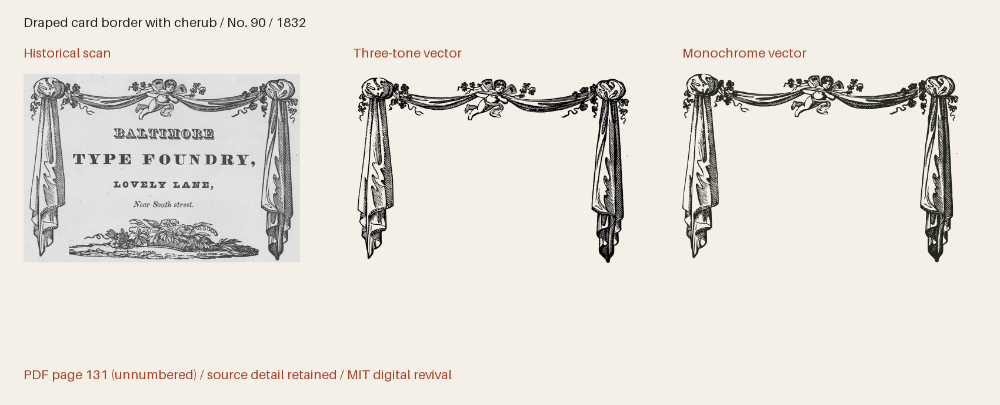

# Baltimore Ornaments 1832

Historical ornaments from A specimen of printing types and ornaments from the Baltimore Type Foundry (1832).



**396 icon(s) · Version 1.001 · MIT**

[SVG files](svg/) · [SVG sprite](web/icons.svg) · [OTF](fonts/BaltimoreOrnaments1832-Regular.otf) · [TTF](fonts/BaltimoreOrnaments1832-Regular.ttf) · [WOFF2](web/BaltimoreOrnaments1832-Regular.woff2) · [Comparison and size proof](specimens/specimen.pdf) · [Icon manifest](icons.json) · [Changes](CHANGELOG.md)

[Three-tone SVGs](svg/multitone/) · [Three-tone sprite](web/icons-multitone.svg) · [Transparent three-tone PNGs](png/multitone/)

## Use in HTML

[Download all web bundle parts](#web-bundle-parts), unzip it, and place
the extracted `collection` folder beside your HTML file. Keep its subfolders
together. The examples below then work as written; adjust the paths if you move
the folder elsewhere. The bundle contains SVGs, PNGs, fonts, CSS, instructions
and the license. No JavaScript or font installation is needed for SVG use.

### Three-tone image — works from disk too

The individual SVG displays all three tones at their default strengths, with a
transparent background. Change `height` to resize it; the proportions are retained.

```html

```

An `` has its own colour context: page CSS cannot recolour its internal
regions. For a decorative image beside a text label, use `alt=""` instead.

### Three-tone sprite — customise every tone

Copy `web/icons-multitone.svg` and use the following complete example on an
HTTP(S) page served from the same origin as the sprite. It draws dark primary ink
and two strengths of red. Each colour and opacity can be changed independently.

```html
<style>
  .revival-cut {
    display: inline-block;
    font-size: 96px;
    height: 1em;
    width: 0.941406em;
    vertical-align: middle;
    --fr-primary-color: #24251f;
    --fr-secondary-color: #a5422c;
    --fr-tertiary-color: #a5422c;
    --fr-primary-opacity: 1;
    --fr-secondary-opacity: 0.55;
    --fr-tertiary-opacity: 0.25;
  }
</style>
<svg class="revival-cut" role="img" aria-label="Draped card border with cherub">
  <use href="collection/baltimore-ornaments-1832/web/icons-multitone.svg#baltimore-1832-p131-90"></use>
</svg>
```

Use the same secondary and tertiary colour and opacity for a two-tone appearance.
The defaults are primary 100%, secondary 55% and tertiary 25%; these are separate
vector regions, not a gradient. The tone assignments interpret the historical
impression. A transparent PNG of the default tones is also provided.

External SVG sprites can be blocked on `file://` pages. To customise tones on a
page opened from disk, open the individual SVG in a text editor, copy its complete
`<svg>…</svg>` markup into your HTML, and add `class="revival-cut"` to that SVG.
The same CSS above then applies to its inline paths. Keep its `viewBox` and paths.
The gallery itself uses inline SVG so its previews work directly from disk.

### Monochrome icon font

Copy the whole `web/` folder, including CSS and webfonts. Standard icon fonts show
the solid artwork; use the SVG examples above for three-tone artwork.

```html
<link rel="stylesheet" href="collection/baltimore-ornaments-1832/web/icons.css">
<span class="fr-icon fr-baltimore-1832-p131-90" aria-hidden="true"
      style="font-size:96px;color:#a5422c"></span>
<span>Draped card border with cherub</span>
```

The example hides a decorative icon from screen readers and supplies visible
text. For an icon that conveys meaning on its own, use `role="img"` and an
`aria-label` instead of `aria-hidden`. Font size and colour use ordinary CSS.

Install the OTF or TTF for desktop use. The manifest lists each icon's Private Use
codepoint and recommended minimum display size. These codepoints are not ordinary
text characters; IDs and codepoints are permanent within this collection.
The example above uses U+E000 and is recommended from
64 px. The 16–192 pt proofs show how detail holds up at different sizes.
Keep the included LICENSE with redistributed assets.

## Evidence and editing

**Foundry:** Baltimore Type Foundry; F. Lucas, Jr., agent

**Designer:** Baltimore Type Foundry; individual engravers generally unidentified (signed large cuts credited in the source inventory)

**Observed:** Impressions from the 1832 Baltimore specimen. Every crop is mapped to a one-based PDF page of this unpaginated book; original JP2 leaves and exact preparation records are retained.

**Interpreted or new:** No new pictorial content. Thresholding, documented crop cleanup, cubic curve fitting and font-unit rounding interpret the scanned impressions. Names, search tags, Private Use assignments, scale and bearings are new project work. Paper, catalogue numbers and prices are excluded. Multi-tone companions separate observed ink strengths into three disjoint vector regions at default opacities 1, 0.55 and 0.25; these are modern interpretations, not evidence of separately printed inks. Separations between joined repeat pieces are inferred from their printed arrangement; complete strips retain the observed context. Version 1.001 applies reviewed rigid rotations to 230 icons to level measured horizontal references, preserving every contour, original scale and advance; source/straightening.json records the evidence and matrices.

- [A specimen of printing types and ornaments from the Baltimore Type Foundry (1832), unnumbered leaf; PDF page 7, Internet Archive leaf 6](https://archive.org/details/ldpd_12198261_000/page/n6/mode/1up) — 1832 US publication, public domain by age; Columbia University Libraries historical scan, distributed through Internet Archive. DPLA item c773fb687c8cc1c610a04becf6baf8e2 records Public domain. No modern digital font or redrawing was used. The MIT license applies to original project work, not ownership of the historical design. [Rights basis](https://dp.la/item/c773fb687c8cc1c610a04becf6baf8e2).
- [A specimen of printing types and ornaments from the Baltimore Type Foundry (1832), unnumbered leaf; PDF page 11, Internet Archive leaf 10](https://archive.org/details/ldpd_12198261_000/page/n10/mode/1up) — 1832 US publication, public domain by age; Columbia University Libraries historical scan, distributed through Internet Archive. DPLA item c773fb687c8cc1c610a04becf6baf8e2 records Public domain. No modern digital font or redrawing was used. The MIT license applies to original project work, not ownership of the historical design. [Rights basis](https://dp.la/item/c773fb687c8cc1c610a04becf6baf8e2).
- [A specimen of printing types and ornaments from the Baltimore Type Foundry (1832), unnumbered leaf; PDF page 79, Internet Archive leaf 78](https://archive.org/details/ldpd_12198261_000/page/n78/mode/1up) — 1832 US publication, public domain by age; Columbia University Libraries historical scan, distributed through Internet Archive. DPLA item c773fb687c8cc1c610a04becf6baf8e2 records Public domain. No modern digital font or redrawing was used. The MIT license applies to original project work, not ownership of the historical design. [Rights basis](https://dp.la/item/c773fb687c8cc1c610a04becf6baf8e2).
- [A specimen of printing types and ornaments from the Baltimore Type Foundry (1832), unnumbered leaf; PDF page 81, Internet Archive leaf 80](https://archive.org/details/ldpd_12198261_000/page/n80/mode/1up) — 1832 US publication, public domain by age; Columbia University Libraries historical scan, distributed through Internet Archive. DPLA item c773fb687c8cc1c610a04becf6baf8e2 records Public domain. No modern digital font or redrawing was used. The MIT license applies to original project work, not ownership of the historical design. [Rights basis](https://dp.la/item/c773fb687c8cc1c610a04becf6baf8e2).
- [A specimen of printing types and ornaments from the Baltimore Type Foundry (1832), unnumbered leaf; PDF page 83, Internet Archive leaf 82](https://archive.org/details/ldpd_12198261_000/page/n82/mode/1up) — 1832 US publication, public domain by age; Columbia University Libraries historical scan, distributed through Internet Archive. DPLA item c773fb687c8cc1c610a04becf6baf8e2 records Public domain. No modern digital font or redrawing was used. The MIT license applies to original project work, not ownership of the historical design. [Rights basis](https://dp.la/item/c773fb687c8cc1c610a04becf6baf8e2).
- [A specimen of printing types and ornaments from the Baltimore Type Foundry (1832), unnumbered leaf; PDF page 85, Internet Archive leaf 84](https://archive.org/details/ldpd_12198261_000/page/n84/mode/1up) — 1832 US publication, public domain by age; Columbia University Libraries historical scan, distributed through Internet Archive. DPLA item c773fb687c8cc1c610a04becf6baf8e2 records Public domain. No modern digital font or redrawing was used. The MIT license applies to original project work, not ownership of the historical design. [Rights basis](https://dp.la/item/c773fb687c8cc1c610a04becf6baf8e2).
- [A specimen of printing types and ornaments from the Baltimore Type Foundry (1832), unnumbered leaf; PDF page 87, Internet Archive leaf 86](https://archive.org/details/ldpd_12198261_000/page/n86/mode/1up) — 1832 US publication, public domain by age; Columbia University Libraries historical scan, distributed through Internet Archive. DPLA item c773fb687c8cc1c610a04becf6baf8e2 records Public domain. No modern digital font or redrawing was used. The MIT license applies to original project work, not ownership of the historical design. [Rights basis](https://dp.la/item/c773fb687c8cc1c610a04becf6baf8e2).
- [A specimen of printing types and ornaments from the Baltimore Type Foundry (1832), unnumbered leaf; PDF page 89, Internet Archive leaf 88](https://archive.org/details/ldpd_12198261_000/page/n88/mode/1up) — 1832 US publication, public domain by age; Columbia University Libraries historical scan, distributed through Internet Archive. DPLA item c773fb687c8cc1c610a04becf6baf8e2 records Public domain. No modern digital font or redrawing was used. The MIT license applies to original project work, not ownership of the historical design. [Rights basis](https://dp.la/item/c773fb687c8cc1c610a04becf6baf8e2).
- [A specimen of printing types and ornaments from the Baltimore Type Foundry (1832), unnumbered leaf; PDF page 91, Internet Archive leaf 90](https://archive.org/details/ldpd_12198261_000/page/n90/mode/1up) — 1832 US publication, public domain by age; Columbia University Libraries historical scan, distributed through Internet Archive. DPLA item c773fb687c8cc1c610a04becf6baf8e2 records Public domain. No modern digital font or redrawing was used. The MIT license applies to original project work, not ownership of the historical design. [Rights basis](https://dp.la/item/c773fb687c8cc1c610a04becf6baf8e2).
- [A specimen of printing types and ornaments from the Baltimore Type Foundry (1832), unnumbered leaf; PDF page 93, Internet Archive leaf 92](https://archive.org/details/ldpd_12198261_000/page/n92/mode/1up) — 1832 US publication, public domain by age; Columbia University Libraries historical scan, distributed through Internet Archive. DPLA item c773fb687c8cc1c610a04becf6baf8e2 records Public domain. No modern digital font or redrawing was used. The MIT license applies to original project work, not ownership of the historical design. [Rights basis](https://dp.la/item/c773fb687c8cc1c610a04becf6baf8e2).
- [A specimen of printing types and ornaments from the Baltimore Type Foundry (1832), unnumbered leaf; PDF page 95, Internet Archive leaf 94](https://archive.org/details/ldpd_12198261_000/page/n94/mode/1up) — 1832 US publication, public domain by age; Columbia University Libraries historical scan, distributed through Internet Archive. DPLA item c773fb687c8cc1c610a04becf6baf8e2 records Public domain. No modern digital font or redrawing was used. The MIT license applies to original project work, not ownership of the historical design. [Rights basis](https://dp.la/item/c773fb687c8cc1c610a04becf6baf8e2).
- [A specimen of printing types and ornaments from the Baltimore Type Foundry (1832), unnumbered leaf; PDF page 97, Internet Archive leaf 96](https://archive.org/details/ldpd_12198261_000/page/n96/mode/1up) — 1832 US publication, public domain by age; Columbia University Libraries historical scan, distributed through Internet Archive. DPLA item c773fb687c8cc1c610a04becf6baf8e2 records Public domain. No modern digital font or redrawing was used. The MIT license applies to original project work, not ownership of the historical design. [Rights basis](https://dp.la/item/c773fb687c8cc1c610a04becf6baf8e2).
- [A specimen of printing types and ornaments from the Baltimore Type Foundry (1832), unnumbered leaf; PDF page 99, Internet Archive leaf 98](https://archive.org/details/ldpd_12198261_000/page/n98/mode/1up) — 1832 US publication, public domain by age; Columbia University Libraries historical scan, distributed through Internet Archive. DPLA item c773fb687c8cc1c610a04becf6baf8e2 records Public domain. No modern digital font or redrawing was used. The MIT license applies to original project work, not ownership of the historical design. [Rights basis](https://dp.la/item/c773fb687c8cc1c610a04becf6baf8e2).
- [A specimen of printing types and ornaments from the Baltimore Type Foundry (1832), unnumbered leaf; PDF page 101, Internet Archive leaf 100](https://archive.org/details/ldpd_12198261_000/page/n100/mode/1up) — 1832 US publication, public domain by age; Columbia University Libraries historical scan, distributed through Internet Archive. DPLA item c773fb687c8cc1c610a04becf6baf8e2 records Public domain. No modern digital font or redrawing was used. The MIT license applies to original project work, not ownership of the historical design. [Rights basis](https://dp.la/item/c773fb687c8cc1c610a04becf6baf8e2).
- [A specimen of printing types and ornaments from the Baltimore Type Foundry (1832), unnumbered leaf; PDF page 103, Internet Archive leaf 102](https://archive.org/details/ldpd_12198261_000/page/n102/mode/1up) — 1832 US publication, public domain by age; Columbia University Libraries historical scan, distributed through Internet Archive. DPLA item c773fb687c8cc1c610a04becf6baf8e2 records Public domain. No modern digital font or redrawing was used. The MIT license applies to original project work, not ownership of the historical design. [Rights basis](https://dp.la/item/c773fb687c8cc1c610a04becf6baf8e2).
- [A specimen of printing types and ornaments from the Baltimore Type Foundry (1832), unnumbered leaf; PDF page 105, Internet Archive leaf 104](https://archive.org/details/ldpd_12198261_000/page/n104/mode/1up) — 1832 US publication, public domain by age; Columbia University Libraries historical scan, distributed through Internet Archive. DPLA item c773fb687c8cc1c610a04becf6baf8e2 records Public domain. No modern digital font or redrawing was used. The MIT license applies to original project work, not ownership of the historical design. [Rights basis](https://dp.la/item/c773fb687c8cc1c610a04becf6baf8e2).
- [A specimen of printing types and ornaments from the Baltimore Type Foundry (1832), unnumbered leaf; PDF page 107, Internet Archive leaf 106](https://archive.org/details/ldpd_12198261_000/page/n106/mode/1up) — 1832 US publication, public domain by age; Columbia University Libraries historical scan, distributed through Internet Archive. DPLA item c773fb687c8cc1c610a04becf6baf8e2 records Public domain. No modern digital font or redrawing was used. The MIT license applies to original project work, not ownership of the historical design. [Rights basis](https://dp.la/item/c773fb687c8cc1c610a04becf6baf8e2).
- [A specimen of printing types and ornaments from the Baltimore Type Foundry (1832), unnumbered leaf; PDF page 109, Internet Archive leaf 108](https://archive.org/details/ldpd_12198261_000/page/n108/mode/1up) — 1832 US publication, public domain by age; Columbia University Libraries historical scan, distributed through Internet Archive. DPLA item c773fb687c8cc1c610a04becf6baf8e2 records Public domain. No modern digital font or redrawing was used. The MIT license applies to original project work, not ownership of the historical design. [Rights basis](https://dp.la/item/c773fb687c8cc1c610a04becf6baf8e2).
- [A specimen of printing types and ornaments from the Baltimore Type Foundry (1832), unnumbered leaf; PDF page 111, Internet Archive leaf 110](https://archive.org/details/ldpd_12198261_000/page/n110/mode/1up) — 1832 US publication, public domain by age; Columbia University Libraries historical scan, distributed through Internet Archive. DPLA item c773fb687c8cc1c610a04becf6baf8e2 records Public domain. No modern digital font or redrawing was used. The MIT license applies to original project work, not ownership of the historical design. [Rights basis](https://dp.la/item/c773fb687c8cc1c610a04becf6baf8e2).
- [A specimen of printing types and ornaments from the Baltimore Type Foundry (1832), unnumbered leaf; PDF page 113, Internet Archive leaf 112](https://archive.org/details/ldpd_12198261_000/page/n112/mode/1up) — 1832 US publication, public domain by age; Columbia University Libraries historical scan, distributed through Internet Archive. DPLA item c773fb687c8cc1c610a04becf6baf8e2 records Public domain. No modern digital font or redrawing was used. The MIT license applies to original project work, not ownership of the historical design. [Rights basis](https://dp.la/item/c773fb687c8cc1c610a04becf6baf8e2).
- [A specimen of printing types and ornaments from the Baltimore Type Foundry (1832), unnumbered leaf; PDF page 115, Internet Archive leaf 114](https://archive.org/details/ldpd_12198261_000/page/n114/mode/1up) — 1832 US publication, public domain by age; Columbia University Libraries historical scan, distributed through Internet Archive. DPLA item c773fb687c8cc1c610a04becf6baf8e2 records Public domain. No modern digital font or redrawing was used. The MIT license applies to original project work, not ownership of the historical design. [Rights basis](https://dp.la/item/c773fb687c8cc1c610a04becf6baf8e2).
- [A specimen of printing types and ornaments from the Baltimore Type Foundry (1832), unnumbered leaf; PDF page 117, Internet Archive leaf 116](https://archive.org/details/ldpd_12198261_000/page/n116/mode/1up) — 1832 US publication, public domain by age; Columbia University Libraries historical scan, distributed through Internet Archive. DPLA item c773fb687c8cc1c610a04becf6baf8e2 records Public domain. No modern digital font or redrawing was used. The MIT license applies to original project work, not ownership of the historical design. [Rights basis](https://dp.la/item/c773fb687c8cc1c610a04becf6baf8e2).
- [A specimen of printing types and ornaments from the Baltimore Type Foundry (1832), unnumbered leaf; PDF page 119, Internet Archive leaf 118](https://archive.org/details/ldpd_12198261_000/page/n118/mode/1up) — 1832 US publication, public domain by age; Columbia University Libraries historical scan, distributed through Internet Archive. DPLA item c773fb687c8cc1c610a04becf6baf8e2 records Public domain. No modern digital font or redrawing was used. The MIT license applies to original project work, not ownership of the historical design. [Rights basis](https://dp.la/item/c773fb687c8cc1c610a04becf6baf8e2).
- [A specimen of printing types and ornaments from the Baltimore Type Foundry (1832), unnumbered leaf; PDF page 131, Internet Archive leaf 130](https://archive.org/details/ldpd_12198261_000/page/n130/mode/1up) — 1832 US publication, public domain by age; Columbia University Libraries historical scan, distributed through Internet Archive. DPLA item c773fb687c8cc1c610a04becf6baf8e2 records Public domain. No modern digital font or redrawing was used. The MIT license applies to original project work, not ownership of the historical design. [Rights basis](https://dp.la/item/c773fb687c8cc1c610a04becf6baf8e2).
- [A specimen of printing types and ornaments from the Baltimore Type Foundry (1832), unnumbered leaf; PDF page 167, Internet Archive leaf 166](https://archive.org/details/ldpd_12198261_000/page/n166/mode/1up) — 1832 US publication, public domain by age; Columbia University Libraries historical scan, distributed through Internet Archive. DPLA item c773fb687c8cc1c610a04becf6baf8e2 records Public domain. No modern digital font or redrawing was used. The MIT license applies to original project work, not ownership of the historical design. [Rights basis](https://dp.la/item/c773fb687c8cc1c610a04becf6baf8e2).
- [A specimen of printing types and ornaments from the Baltimore Type Foundry (1832), unnumbered leaf; PDF page 169, Internet Archive leaf 168](https://archive.org/details/ldpd_12198261_000/page/n168/mode/1up) — 1832 US publication, public domain by age; Columbia University Libraries historical scan, distributed through Internet Archive. DPLA item c773fb687c8cc1c610a04becf6baf8e2 records Public domain. No modern digital font or redrawing was used. The MIT license applies to original project work, not ownership of the historical design. [Rights basis](https://dp.la/item/c773fb687c8cc1c610a04becf6baf8e2).
- [A specimen of printing types and ornaments from the Baltimore Type Foundry (1832), unnumbered leaf; PDF page 187, Internet Archive leaf 186](https://archive.org/details/ldpd_12198261_000/page/n186/mode/1up) — 1832 US publication, public domain by age; Columbia University Libraries historical scan, distributed through Internet Archive. DPLA item c773fb687c8cc1c610a04becf6baf8e2 records Public domain. No modern digital font or redrawing was used. The MIT license applies to original project work, not ownership of the historical design. [Rights basis](https://dp.la/item/c773fb687c8cc1c610a04becf6baf8e2).

Copyright (c) 2026 Harold Lehmann. Historical public-domain material retains its status.
Read [the method](source/METHOD.md), [inventory](source/inventory.json) and
[icon workflow](../../docs/ICONS.md). The canonical master is `source/font.ttx`;
SVGs, sprite, fonts and manifests are generated from it with glyph edits applied.

```sh
python scripts/fontrevival.py build baltimore-ornaments-1832
python scripts/fontrevival.py sizecheck baltimore-ornaments-1832
python scripts/fontrevival.py check baltimore-ornaments-1832
python scripts/fontrevival.py glyph baltimore-ornaments-1832 uniE000
```

## Sprite files

The sprites span numbered SVG files in `web/`. Each icon’s manifest entry and gallery example names the file containing it. Keep all sprite files together when distributing the collection.

## Detailed engravings and font limits

SVG and the editable CFF master retain the full outlines. The OTF, TTF and webfonts use reviewed approximations for outlines exceeding font renderer limits. Their measurements and master fingerprints are recorded in `source/truetype-glyphs/`; see `source/METHOD.md` for display-size review.

All downloadable fonts use reviewed simplifications for the most detailed engravings. The editable master, SVGs and tonal PNGs retain the full historical outlines; use SVG for enlarged artwork.

## Web bundle parts

Download every part and extract them into the same folder.

- [ZIP part 1](downloads/baltimore-ornaments-1832-web.zip) — 86.4 MB
- [ZIP part 2](downloads/baltimore-ornaments-1832-web-2.zip) — 22.1 MB
