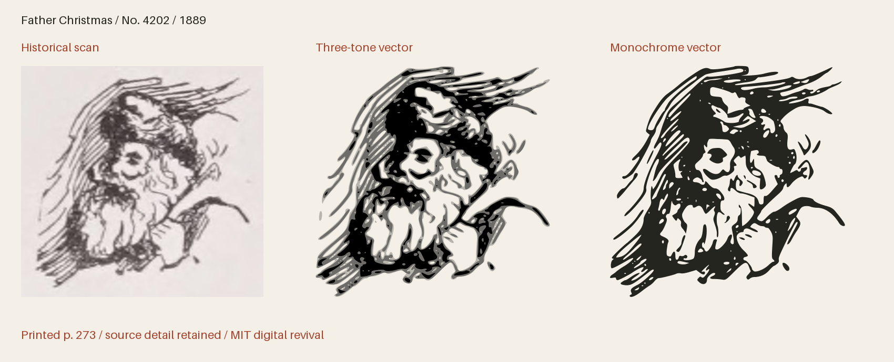

# Boston Cuts 1889

Historical ornaments, pictorial cuts, decorated initials and symbols from the Boston Type Foundry specimen of 1889.



**478 icon(s) · Version 1.003 · MIT**

[SVG files](svg/) · [SVG sprite](web/icons.svg) · [OTF](fonts/BostonCuts1889-Regular.otf) · [TTF](fonts/BostonCuts1889-Regular.ttf) · [WOFF2](web/BostonCuts1889-Regular.woff2) · [Comparison and size proof](specimens/specimen.pdf) · [Icon manifest](icons.json) · [Changes](CHANGELOG.md)

[Three-tone SVGs](svg/multitone/) · [Three-tone sprite](web/icons-multitone.svg) · [Transparent three-tone PNGs](png/multitone/)

## Use in HTML

[Download the web bundle (ZIP)](downloads/boston-cuts-1889-web.zip), unzip it, and place
the extracted `collection` folder beside your HTML file. Keep its subfolders
together. The examples below then work as written; adjust the paths if you move
the folder elsewhere. The bundle contains SVGs, PNGs, fonts, CSS, instructions
and the license. No JavaScript or font installation is needed for SVG use.

### Three-tone image — works from disk too

The individual SVG displays all three tones at their default strengths, with a
transparent background. Change `height` to resize it; the proportions are retained.

```html

```

An `` has its own colour context: page CSS cannot recolour its internal
regions. For a decorative image beside a text label, use `alt=""` instead.

### Three-tone sprite — customise every tone

Copy `web/icons-multitone.svg` and use the following complete example on an
HTTP(S) page served from the same origin as the sprite. It draws dark primary ink
and two strengths of red. Each colour and opacity can be changed independently.

```html
<style>
  .revival-cut {
    display: inline-block;
    font-size: 96px;
    height: 1em;
    width: 0.954590em;
    vertical-align: middle;
    --fr-primary-color: #24251f;
    --fr-secondary-color: #a5422c;
    --fr-tertiary-color: #a5422c;
    --fr-primary-opacity: 1;
    --fr-secondary-opacity: 0.55;
    --fr-tertiary-opacity: 0.25;
  }
</style>
<svg class="revival-cut" role="img" aria-label="Father Christmas">
  <use href="collection/boston-cuts-1889/web/icons-multitone.svg#boston-1889-4202"></use>
</svg>
```

Use the same secondary and tertiary colour and opacity for a two-tone appearance.
The defaults are primary 100%, secondary 55% and tertiary 25%; these are separate
vector regions, not a gradient. The tone assignments interpret the historical
impression. A transparent PNG of the default tones is also provided.

External SVG sprites can be blocked on `file://` pages. To customise tones on a
page opened from disk, open the individual SVG in a text editor, copy its complete
`<svg>…</svg>` markup into your HTML, and add `class="revival-cut"` to that SVG.
The same CSS above then applies to its inline paths. Keep its `viewBox` and paths.
The gallery itself uses inline SVG so its previews work directly from disk.

### Monochrome icon font

Copy the whole `web/` folder, including CSS and webfonts. Standard icon fonts show
the solid artwork; use the SVG examples above for three-tone artwork.

```html
<link rel="stylesheet" href="collection/boston-cuts-1889/web/icons.css">
<span class="fr-icon fr-boston-1889-4202" aria-hidden="true"
      style="font-size:96px;color:#a5422c"></span>
<span>Father Christmas</span>
```

The example hides a decorative icon from screen readers and supplies visible
text. For an icon that conveys meaning on its own, use `role="img"` and an
`aria-label` instead of `aria-hidden`. Font size and colour use ordinary CSS.

Install the OTF or TTF for desktop use. The manifest lists each icon's Private Use
codepoint and recommended minimum display size. These codepoints are not ordinary
text characters; IDs and codepoints are permanent within this collection.
The example above uses U+E000 and is recommended from
64 px. The 16–192 pt proofs show how detail holds up at different sizes.
Keep the included LICENSE with redistributed assets.

## Evidence and editing

**Foundry:** Boston Type Foundry; holiday cuts cast by Central Type Foundry

**Designer:** Individual engravers unidentified; holiday cuts credited to Central Type Foundry in the specimen

**Observed:** Individually catalogued historical impressions from the 1889 Boston specimen; see each icon and source/inventory.json for subjects, pages, specimen numbers, crop evidence and review status.

**Interpreted or new:** No new pictorial content. Thresholding, documented crop cleanup, cubic curve fitting and font-unit rounding interpret the scanned impressions. Names, search tags, Private Use assignments, scale and bearings are new project work. Paper, catalogue numbers and prices are excluded. Multi-tone companions separate observed ink strengths into three disjoint vector regions at default opacities 1, 0.55 and 0.25; these are modern interpretations, not evidence of separately printed inks.

- [Specimen book from the Boston type foundry (1889), printed p. 273, Section 8, original holiday cuts 4201–4248; PDF page 281, Internet Archive leaf 281](https://archive.org/details/specimenbookfrom00unse/page/273/mode/1up) — 1889 US publication; public domain in the United States under the maximum 95-year term. Library of Congress scan hosted by Internet Archive; its recorded assessment says the Library is unaware of copyright restrictions. Metadata and page map are retained locally. No modern redraw was used. [Rights basis](https://www.copyright.gov/circs/circ15a.pdf).
- [Specimen book from the Boston type foundry (1889), printed p. 274; PDF page 282, Internet Archive leaf 282](https://archive.org/details/specimenbookfrom00unse/page/274/mode/1up) — 1889 US publication; public domain in the United States under the maximum 95-year term. Library of Congress scan hosted by Internet Archive; its recorded assessment says the Library is unaware of copyright restrictions. Metadata and page map are retained locally. No modern redraw was used. [Rights basis](https://www.copyright.gov/circs/circ15a.pdf).
- [Specimen book from the Boston type foundry (1889), printed p. 275; PDF page 283, Internet Archive leaf 283](https://archive.org/details/specimenbookfrom00unse/page/275/mode/1up) — 1889 US publication; public domain in the United States under the maximum 95-year term. Library of Congress scan hosted by Internet Archive; its recorded assessment says the Library is unaware of copyright restrictions. Metadata and page map are retained locally. No modern redraw was used. [Rights basis](https://www.copyright.gov/circs/circ15a.pdf).
- [Specimen book from the Boston type foundry (1889), printed p. 276; PDF page 284, Internet Archive leaf 284](https://archive.org/details/specimenbookfrom00unse/page/276/mode/1up) — 1889 US publication; public domain in the United States under the maximum 95-year term. Library of Congress scan hosted by Internet Archive; its recorded assessment says the Library is unaware of copyright restrictions. Metadata and page map are retained locally. No modern redraw was used. [Rights basis](https://www.copyright.gov/circs/circ15a.pdf).
- [Specimen book from the Boston type foundry (1889), printed p. 271; PDF page 279, Internet Archive leaf 279](https://archive.org/details/specimenbookfrom00unse/page/271/mode/1up) — 1889 US publication; public domain in the United States under the maximum 95-year term. Library of Congress scan hosted by Internet Archive; its recorded assessment says the Library is unaware of copyright restrictions. Metadata and page map are retained locally. No modern redraw was used. [Rights basis](https://www.copyright.gov/circs/circ15a.pdf).
- [Specimen book from the Boston type foundry (1889), printed p. 272; PDF page 280, Internet Archive leaf 280](https://archive.org/details/specimenbookfrom00unse/page/272/mode/1up) — 1889 US publication; public domain in the United States under the maximum 95-year term. Library of Congress scan hosted by Internet Archive; its recorded assessment says the Library is unaware of copyright restrictions. Metadata and page map are retained locally. No modern redraw was used. [Rights basis](https://www.copyright.gov/circs/circ15a.pdf).

Copyright (c) 2026 Harold Lehmann. Historical public-domain material retains its status.
Read [the method](source/METHOD.md), [inventory](source/inventory.json) and
[icon workflow](../../docs/ICONS.md). The canonical master is `source/font.ttx`;
SVGs, sprite, fonts and manifests are generated from it with glyph edits applied.

```sh
python scripts/fontrevival.py build boston-cuts-1889
python scripts/fontrevival.py sizecheck boston-cuts-1889
python scripts/fontrevival.py check boston-cuts-1889
python scripts/fontrevival.py glyph boston-cuts-1889 uniE000
```
