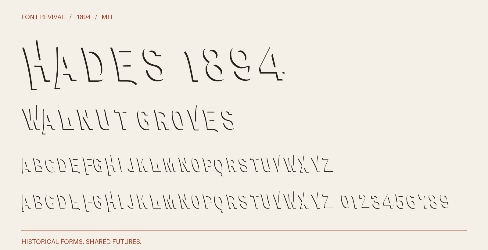

# Hades 1894

Open shadow contours for overprinting with Erebus 1894, with matching advances and kerning.



**1894 · Regular · Version 1.000 · 104 characters · Capitals only · MIT**

[OTF](fonts/Hades1894-Regular.otf) · [TTF](fonts/Hades1894-Regular.ttf) · [WOFF2](web/Hades1894-Regular.woff2) · [PDF specimen](specimens/specimen.pdf) · [Changes](CHANGELOG.md)

## Use

Install either desktop format. For websites, copy `web/`, include `font.css`,
and use `font-family: "Hades 1894"`. Designed for display sizes.

## Design

**Designer:** Unidentified in the consulted primary specimens

**Foundry:** Central Type Foundry, St. Louis

**Observed:** The historical Hades specimens establish the open lower-left shadow construction and its pairing with Erebus. Retained comparison crops show BASKET, HOLDER, WALNUT and GROVES, plus figures 7 and 8. See Erebus 1894 for the underlying observed letterforms.

**Reconstructed:** Every outline is a new registered reconstruction: Erebus 1894 shifted 28 units left and down, minus its original silhouette. The offset is an optical interpretation of the historical edge weight, not a measured metal-type registration. Rare sorts follow Erebus’s documented inferences. Advances, character map and kerning match Erebus exactly; lowercase aliases capitals. Place both fonts at the same origin, size, tracking and line height. The source year does not assert a first release.

## Sources

1. [John Ryan Foundry, Latest and Standard Faces in Type (September 1894), printed p. 77](https://archive.org/details/lateststandardfa00ryan/page/77/mode/1up) — 1894 US publication, beyond the maximum 95-year term. Library of Congress scan; institutional rights statement retained in reference/ryan-rights.json. [Rights basis](https://archive.org/metadata/lateststandardfa00ryan).
2. [American Type Founders, Collective Specimen Book (1895/96), printed p. 511](https://www.galleyrack.com/images/artifice/letters/press/noncomptype/typography/atf/atf-collective-specimen-garland-badscan/atf-1896-specimens-of-type-garland-1981-smallpart-377-hades-series-central-type-foundry-publicdomain.pdf) — Historical 1895/96 US specimen page, public domain under the maximum 95-year term; scanned from the 1981 Garland facsimile. This reference contains only the nineteenth-century page, not the modern introduction. Rendered at 400 dpi in grayscale from the linked PDF. [Rights basis](https://www.circuitousroot.com/artifice/letters/press/noncomptype/typography/atf/atf-collective-specimen-garland-badscan/index.html).

Source images are in `reference/`; the source record is [font.json](font.json).
Historical reference material retains the rights status recorded there.
The digital revival is released under the included [MIT License](LICENSE).

## Build or improve

From the repository root:

```sh
python scripts/fontrevival.py build hades-1894
python scripts/fontrevival.py check hades-1894
```

Edit `source/font.ttx` or export an individual glyph with
`python scripts/fontrevival.py glyph hades-1894 j`.
Follow the shared [revival workflow](../../docs/WORKFLOW.md) for additions and revisions.
