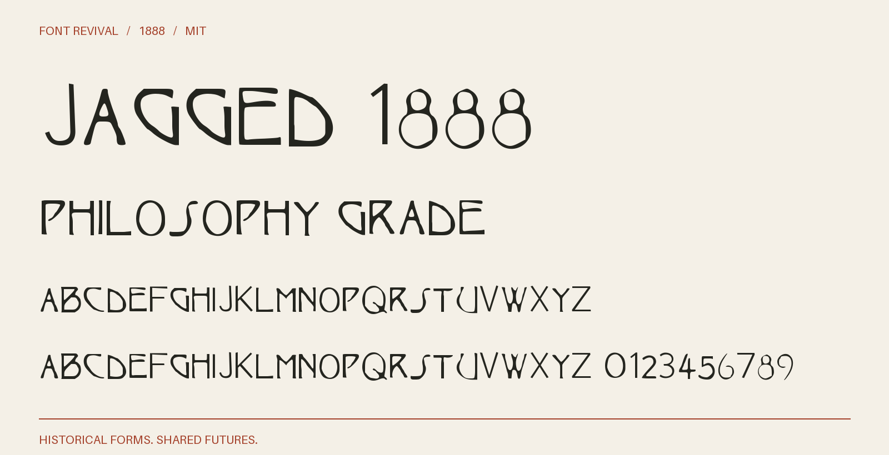

# Jagged 1888

Angular, lightly drawn display capitals following the historical No. 39 cut.



**1888 · Regular · Version 1.000 · 104 characters · Capitals only · MIT**

[OTF](fonts/Jagged1888-Regular.otf) · [TTF](fonts/Jagged1888-Regular.ttf) · [WOFF2](web/Jagged1888-Regular.woff2) · [PDF specimen](specimens/specimen.pdf) · [Changes](CHANGELOG.md)

## Use

Install either desktop format. For websites, copy `web/`, include `font.css`,
and use `font-family: "Jagged 1888"`. Designed for display sizes.

## Design

**Designer:** Unidentified in the consulted primary specimens

**Foundry:** Dickinson Type Foundery, Boston

**Observed:** Directly sampled alphabet and figures: ABCDEGHILMNOPQRSTUWY24568. Additional observed symbols and exact crop/cleanup settings are enumerated in source/tracing.json.

**Reconstructed:** Inferred alphabet/figures: FJKVXZ01379. Unobserved punctuation and symbols are newly drawn MIT project companions. Spacing, kerning and optical-size harmonisation are new. Lowercase input aliases capitals. No. 39 only; Nos. 40 and 41 are separate cuts. The year identifies the specimen, not a claimed first release.

## Sources

1. [John Ryan Foundry, Latest and Standard Faces in Type (September 1894), printed p. 121](https://archive.org/details/lateststandardfa00ryan/page/121/mode/1up) — 1894 US publication, beyond the maximum 95-year term. Library of Congress scan; institutional rights statement retained in reference/ryan-rights.json. [Rights basis](https://archive.org/metadata/lateststandardfa00ryan).
2. [American Type Founders, Collective Specimen Book (1895/96), printed p. 345](https://www.galleyrack.com/images/artifice/letters/press/noncomptype/typography/atf/atf-collective-specimen-garland-badscan/atf-1896-specimens-of-type-garland-1981-smallpart-227-the-jagged-series-and-the-moxon-series-dickinson-type-foundery-publicdomain.pdf) — Historical 1895/96 US specimen page, public domain under the maximum 95-year term; scanned from the 1981 Garland facsimile. This reference contains only the nineteenth-century page, not the modern introduction. Rendered at 400 dpi in grayscale from the linked PDF. [Rights basis](https://www.circuitousroot.com/artifice/letters/press/noncomptype/typography/atf/atf-collective-specimen-garland-badscan/index.html).
3. [The Inland Printer, vol. 6, no. 2 (November 1888), printed p. 147](https://archive.org/details/sim_american-printer_1888-11_6_2/page/n58/mode/1up) — 1888 US journal, public domain under the maximum 95-year term. Faithful microfilm scan; issue and provenance retained in reference/printer-metadata.json. [Rights basis](https://www.copyright.gov/circs/circ15a.pdf).
4. [American Type Founders, Desk Book of Printing Types (1898), printed p. 493; JP2 member 0487](https://archive.org/details/deskbookofprinti00amer) — Nineteenth-century US publication, beyond the maximum 95-year term. Library of Congress scan; institutional metadata retained with the reference. [Rights basis](https://archive.org/metadata/deskbookofprinti00amer).

Source images are in `reference/`; the source record is [font.json](font.json).
Historical reference material retains the rights status recorded there.
The digital revival is released under the included [MIT License](LICENSE).

## Build or improve

From the repository root:

```sh
python scripts/fontrevival.py build jagged-1888
python scripts/fontrevival.py check jagged-1888
```

Edit `source/font.ttx` or export an individual glyph with
`python scripts/fontrevival.py glyph jagged-1888 j`.
Follow the shared [revival workflow](../../docs/WORKFLOW.md) for additions and revisions.
