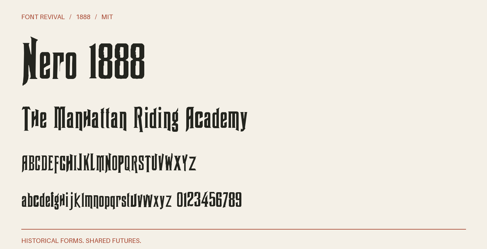

# Nero 1888

A condensed, chiseled display face with pointed terminals, deep notches, and dramatic descenders.



**1888 · Regular · Version 1.002 · 302 characters · MIT**

[OTF](fonts/Nero1888-Regular.otf) · [TTF](fonts/Nero1888-Regular.ttf) · [WOFF2](web/Nero1888-Regular.woff2) · [PDF specimen](specimens/specimen.pdf) · [Changes](CHANGELOG.md)

## Use

Install either desktop format. For websites, copy `web/`, include `font.css`,
and use `font-family: "Nero 1888"`. Designed for display sizes.

## Design

**Designer:** Julius Herriet, Sr. (attributed)

**Foundry:** James Conner’s Sons

**Observed:** Capitals A C D E F G H I K L M N O P R S T U V W; lowercase a c d e f g h i l m n o p r s t u v x y; numerals 0–9.

**Reconstructed:** B J Q X Y Z and b j k q w z; modern punctuation, symbols, accented extensions and ligatures. Reconstructed forms follow the observed stroke vocabulary.

## Sources

1. [The Inland Printer, vol. 6, no. 2 (November 1888), p. 141](https://archive.org/details/sim_american-printer_1888-11_6_2/page/140/mode/2up) — US publication from 1888, beyond the maximum copyright term; scan supplied with the revival as public domain [Rights basis](https://www.copyright.gov/circs/circ15a.pdf).
2. [John Ryan Foundry, Latest and Standard Faces in Type (1894), p. 135](https://archive.org/details/lateststandardfa00ryan/page/134/mode/2up) — US publication from 1894, beyond the maximum copyright term; scan supplied with the revival as public domain [Rights basis](https://www.copyright.gov/circs/circ15a.pdf).

Source images are in `reference/`; the source record is [font.json](font.json).
Historical reference material retains the rights status recorded there.
The digital revival is released under the included [MIT License](LICENSE).

## Build or improve

From the repository root:

```sh
python scripts/fontrevival.py build nero-1888
python scripts/fontrevival.py check nero-1888
```

Edit `source/font.ttx` or export an individual glyph with
`python scripts/fontrevival.py glyph nero-1888 j`.
Follow the shared [revival workflow](../../docs/WORKFLOW.md) for additions and revisions.
