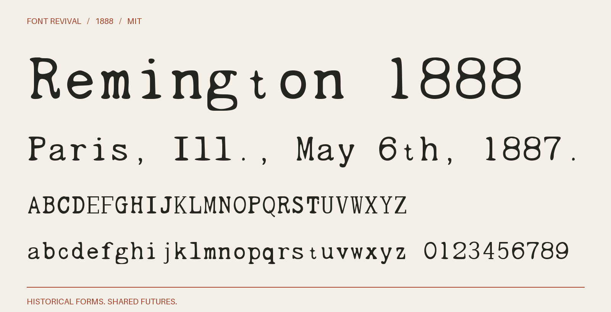

# Remington 1888

A monospaced metal-type imitation of typewriting, following the 12-point No. 2 cut.



**1888 · Regular · Version 1.000 · 104 characters · MIT**

[OTF](fonts/Remington1888-Regular.otf) · [TTF](fonts/Remington1888-Regular.ttf) · [WOFF2](web/Remington1888-Regular.woff2) · [PDF specimen](specimens/specimen.pdf) · [Changes](CHANGELOG.md)

## Use

Install either desktop format. For websites, copy `web/`, include `font.css`,
and use `font-family: "Remington 1888"`. Designed for display sizes.

## Design

**Designer:** Unidentified in the consulted primary specimens

**Foundry:** Barnhart Brothers & Spindler, Chicago

**Observed:** Directly sampled alphabet and figures: ABCDGHIJLMNPRSTabcdefghiklmnopqrstuvwxyz012678. Additional observed symbols and exact crop/cleanup settings are enumerated in source/tracing.json.

**Reconstructed:** Inferred alphabet/figures: EFKOQUVWXYZj3459. Unobserved punctuation and symbols are newly drawn MIT project companions. Fixed-cell spacing and proportion harmonisation are new; there is no kerning. Uppercase and lowercase are distinct. 12-point No. 2 only; the 10-point cut is excluded. The year identifies the specimen, not a claimed first release.

## Sources

1. [The Inland Printer, vol. 6, no. 2 (November 1888), printed p. 137](https://archive.org/details/sim_american-printer_1888-11_6_2/page/n48/mode/1up) — 1888 US journal, public domain under the maximum 95-year term. Faithful microfilm scan; issue and provenance retained in reference/printer-metadata.json. [Rights basis](https://www.copyright.gov/circs/circ15a.pdf).

Source images are in `reference/`; the source record is [font.json](font.json).
Historical reference material retains the rights status recorded there.
The digital revival is released under the included [MIT License](LICENSE).

## Build or improve

From the repository root:

```sh
python scripts/fontrevival.py build remington-1888
python scripts/fontrevival.py check remington-1888
```

Edit `source/font.ttx` or export an individual glyph with
`python scripts/fontrevival.py glyph remington-1888 j`.
Follow the shared [revival workflow](../../docs/WORKFLOW.md) for additions and revisions.
